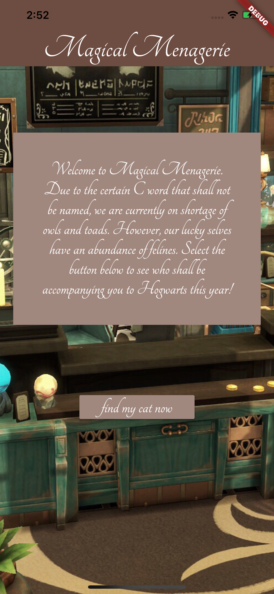
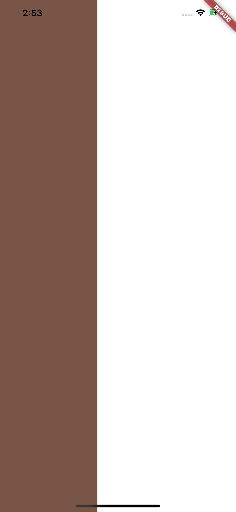
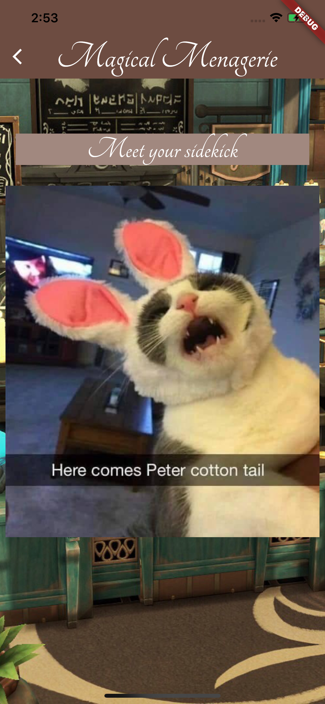

# Hogwarts Pet Finder

Welcome to Hogwarts Pet Finder, the virtual adjustment for the C-word that must not be named. This year we have collaborated with *Magical Menagerie* to help you find your destined companion to begin your wondrous journey at Hogwarts! Please see the excerpts and spells below to get started.

<p float="left">
   
  
  
</p>

## Getting Started

### Prerequisites

* Flutter
* VS Code
* Android Studio - develop for android devices
* XCode - develop for iOS 

### Installing


Clone and open this repository

```
git clone https://github.com/Hana008/hogwarts-pet-finder.git
cd be-nc-news
code .
```

Install all dependencies

```
flutter pub get
```

### Run the app 

You may use either Android Studio (recommended) or Xcode, this will not work on local server


